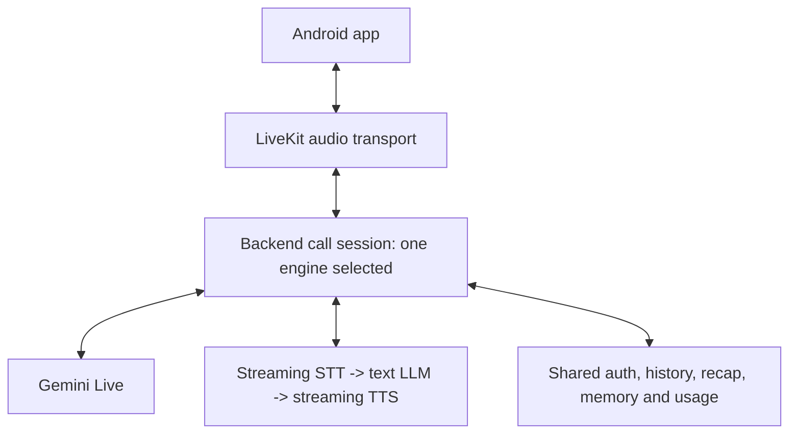

# Voice Engines and Product Implementation SDD

Version: 0.2 | Date: 2026-10-01 | Status: offline implementation in progress; native conversation observed; cascade live validation pending.

Purpose: preserve the working Gemini Live conversation, evaluate a cheaper and voice-configurable cascade, then deliver the complete v1 thinking-partner journey through shared product services.
Creating this document does not authorize code changes, installs, migrations, builds, provider requests, workers, purchases, commits or pushes.

## 1. Authority and current evidence

This SDD is subordinate to these documents; it does not amend their locked scope:

1. [Prototype Specification v1.0.1](../Voice-Thinking-Partner-Prototype-Specification-v1.0.1.md) (Spec).
2. [Architecture Charter v0.2](../Architecture-Charter-Voice-Thinking-Partner-v0.2.md) (Charter).
3. [Backend Blueprint v0.2](../Backend-Implementation-Blueprint-and-Architecture-Stress-Test-v0.2.md) (Blueprint), only within Spec v1 scope.
4. Actual `AGENTS.md`, README and [HANDOFF](../HANDOFF.md) for execution restrictions and dated evidence.

Starting snapshot: `codex/voice-trial-corrections` at `2aa5b2d`, plus staged, unstaged and untracked corrections. Preserve all existing work; HEAD alone is not the working conversation implementation.
The [2026-10-01 device record](../device-trial-2026-10-01-conversation.md) establishes owner-observed conversation, seven completed provider turns and 108 returned audio chunks.
Unmute failed according to the owner; exact error and timing relative to room cutoff are unknown. Do not assume an independent mic defect or a verified cutoff explanation.
OS mic-indicator confirmation in that record remains pending. One successful call does not establish interruption, reconnect, latency, retention or pilot readiness.
Auth, durable product history, recap, memory and production admission control are not implemented by the voice spike. Existing test counts are historical evidence, not fresh checks for this SDD.

The supplied Mindmap Canon SDD/worklog/hierarchy paths are absent in this checkout. Do not invent citations or import its milestones/data model into the voice app. The job-broker instruction conflict is explicitly gated in section 12.

## 2. Intent, scope and traceability

The user wants lower cost and custom-voice flexibility alongside the working setup, without another large subsystem or a regression of microphone ownership.
The full product remains an Android, foreground, Indian English/Hinglish thinking partner for 5-10 invited adults, with accurate continuity across calls (Spec sections 1-2).

| Requirement | Source | Implementation boundary |
| --- | --- | --- |
| Invite-only access, disclosure, one private project | Spec P01, sections 2/4 | Shared identity/project services; backend authorization |
| Start, Mute, End, failed-setup retry without duplicate ownership | Spec P02 | Existing native lifecycle plus shared server session ownership |
| Natural pauses, interruption, uncertain names/numbers, Hinglish | Spec P03 | LiveKit AgentSession, provider configuration and device evaluation |
| Generated speech differs from delivered speech | Spec P04; Charter section 3 | Runtime playback accounting and history contract |
| Recovery within 30 seconds, otherwise clear end | Spec P05 | Session coordinator; no competing owners |
| Finalized history and idempotent recap | Spec P06/P07 | Conversation storage and durable finalization |
| Explicit memories, correction, retrieval and dependent deletion | Spec P08-P11, sections 5-6 | Knowledge services with provenance and revision/deletion fences |
| Usage, duration, concurrency, log privacy and currency budgets | Spec P12, sections 6/8 | Admission and usage services, controlled diagnostics |

The cascade is a provider-comparison configuration, not a second product. Keep one chosen voice/personality for the pilot; a consented custom voice is a backend evaluation option, not a voice marketplace.
Defer search, external actions, reminders, additional languages, background calling, multi-project navigation, vector search and seamless provider failover (Spec sections 7/9).

## 3. Architectural decision

Source: Spec sections 7/7.1; Charter sections 1/4; Blueprint section 1.

Retain React Native/Expo, LiveKit Cloud, LiveKit Agents Python and FastAPI. Reuse AgentSession's supported STT/LLM/TTS orchestration; do not write a separate audio loop or add Pipecat without a demonstrated limitation.
Exactly one coordinator and one selected engine own each call. Select the engine before connection; never start both engines for one call or switch silently after failure.
Both configurations share identity, session state, instructions, context rules, history, recap, memory, deletion and usage accounting.
Keep provider-specific SDK behavior inside the provider construction/adapter boundary. SDK callbacks never grant authorization or own durable product state.

During development, run one selected named worker configuration at a time. Never register native and cascade workers under the same dispatch name simultaneously and rely on assignment order.
The current Audio Test can retain its existing native transport and controls initially. A backend/operator choice is sufficient for comparison; a mobile provider picker is not required.
For the product, FastAPI derives account/project scope, reserves admission, creates the session and issues short-lived scoped media access. Replace the public development sandbox token path before invited-user access (Blueprint section 3).

## 4. Provider configurations and compatibility

Source: Spec sections 7.1/8; Charter section 6. Provider facts are a 2026-10-01 documentation snapshot; account access and actual behavior require separate verification.

| Configuration | Intended role | Qualification |
| --- | --- | --- |
| Gemini Live, existing model/voice and reviewed PCM correction | Preserve working baseline | Retain current diagnostics, startup bootstrap and one-connection trial guard |
| Sarvam streaming STT -> Gemini 3.1 Flash-Lite text -> Sarvam Bulbul v3 | First cascade experiment using available credit | Confirm streaming endpoint entitlement, compatible plugin pins and language behavior |
| Soniox streaming STT -> Gemini 3.1 Flash-Lite text -> Soniox streaming TTS | Later lower-cost/custom-voice candidate | Separate access approval, plugin/model compatibility and device quality evaluation |

Use the existing Google key for the candidate text LLM; a new LLM vendor is not required. Flash-Lite is a candidate, not an established quality winner for thoughtful conversation.
Use Sarvam STT's supported automatic language/codemix configuration; do not translate all user speech into English or invent a mobile language toggle.
Select exact STT endpoint/model and TTS language/voice settings only after checking the compatible plugin's supported parameters. Sarvam `STTRealtime` has a separate realtime-access requirement; the key and signup credit do not prove entitlement.
Stream LLM text into streaming TTS as supported, rather than waiting for the full answer. Evaluate chunking against natural prosody and interruption behavior.
Start with a stock voice. Verify streaming support for a cloned voice separately; the existence of a cloning API does not prove compatibility with the selected LiveKit TTS plugin.

The working environment pins `livekit-agents==1.2.12` and `livekit-plugins-google==1.2.9`. Mutable Sarvam plugin sources returned inconsistent Agents minimum versions (>=1.5.0 and >=1.6.6); neither establishes current compatibility. Integration guides targeting the 1.8 series do not establish compatibility with the installed profile.
Before integration, record immutable release/commit dependency metadata and verify tested exact core/plugin/model pins and supported public interfaces (D2). No dependency profile is selected by this SDD.
Do not install current plugins into the working environment opportunistically. Verify whether compatible pins exist; otherwise use an isolated development environment and pipeline-specific lockfiles.
Isolation is for dependencies/processes, not a second business architecture. Shared lifecycle code must pass conformance checks in every supported profile; compatibility is not presumed.
Keep foundation dependencies separate. No requirements or SDK installation is authorized by this document.
Do not apply Google's private Live-session audio/reconnect wrappers to ordinary text LLM requests or Sarvam/Soniox sockets. Preserve the native restriction while specifying stage-specific failure/cancellation rules for the cascade.
Multiple ordinary text turns are expected; they are not violations of the native Live-session one-connection policy. Any retry consumption must still be recorded and bounded.

## 5. Session and provider contracts

Source: Charter sections 2-4; Blueprint section 3; Spec P04-P06/P12 and section 5.

Use existing SDK interfaces where sufficient; add only the application contracts needed by the current slice. No generic provider registry, plugin loader or parallel class hierarchy.

| Application fact | Minimum meaning |
| --- | --- |
| Session scope | Stable session ID, authorized account/project, engine and tested configuration versions |
| Finalized user utterance | Ordered utterance ID and finalized text; provisional recognition never becomes durable fact automatically |
| Assistant response | Response ID, generated text, delivered extent and confirmed/estimated/unknown delivery status |
| Usage attempt | Session/attempt/provider correlation, metered units, rate version and known/estimated/reconciled cost |
| Context snapshot | Authorized source IDs/revisions and bounded content; obsolete sources cannot re-enter later |
| Terminal outcome | Structured reason/type, cleanup evidence and incomplete status where confirmation is missing |

Identifiers and provider events must correlate without logging transcript/prompt/audio content. Public/persisted contracts are versioned; internal SDK objects remain adapter-local.
Provider construction supplies the selected engine's components, capabilities and close/cancel behavior. The coordinator owns ordering, interruptions, context changes and terminal state.
For delivery, SDK generation completion or audio-chunk counts do not prove phone playback. Validate the available playback cursor/acknowledgment; retain uncertainty conservatively.
An interrupted answer's unheard suffix must be excluded from future context and finalization; correction/deletion must exclude stale sources before continuing. Each pilot candidate must demonstrate correct provider behavior that excludes unheard/stale content, or a bounded provider-session replacement using permitted delivered history (D6).
The installed Google adapter's active-session `update_chat_ctx` does not remove server messages and `truncate` is a no-op. This leaves feasibility unresolved; it does not prove that all server-side interruption behavior is unsupported. Local history changes alone do not establish provider-context correctness.
Any replacement policy must document one application-session owner, suppression of old output and provider cleanup, permitted context with conservative playback uncertainty, and additional connection usage, admission and failure handling.
Preserve the native development-trial one-connection/no-retry restriction. A fresh provider object must not silently bypass it. Any product replacement/recovery policy requires separate authorization and verification before activation.

## 6. Lifecycle, interruption and recovery

Source: Spec P02-P05; Charter sections 3-5; existing `AGENTS.md` trial restrictions.

1. Validate selected provider prerequisites and admission before joining a room. For development, retain main-thread plugin initialization and hot reload disabled.
2. Start only the selected configuration; use one authoritative session identity. Preserve existing abort checks, orphan/recovery ownership and truthful cleanup flags.
3. Finalize user speech using the selected supported turn-detection strategy. Tune thoughtful pauses from evidence; do not add competing turn detectors.
4. On user interruption, stop playback, cancel obsolete generation where supported and update delivered history/context. Late chunks cannot resume an obsolete response or enter a different call.
5. Mute stops microphone transmission without ending the call. Provider handling of silence/end-of-input must not create a spurious turn or restart a closed session. Mute is not proof that metering stopped.
6. End prevents new input/output, initiates cleanup and releases ownership only with appropriate evidence. Cleanup failure remains actionable through End retry; it must not be erased by late success/status callbacks.
7. Backgrounding and permission-dialog transitions follow the existing native safety policy; a dead Start cannot become live after remount/foreground return.
8. Pilot reconnect follows P05's 30-second grace and account ownership checks. The current dev no-retry policy is unchanged; production recovery needs an explicit, tested policy before activation.

Never infer room closure from a screen state, muted mic, watchdog or worker timeout. Async cancellation is a request, not a hard wall-clock guarantee; keep the independent operator/administrative stop procedure for approved trials.
The successful trial's Unmute issue must first be confirmed against error/dispatch/cutoff timing. Correct only a reproduced defect; add a cutoff-overlap regression when evidence establishes that order.

## 7. Shared product services and data correctness

Source: Spec P01/P06-P11, sections 4-7/10; Charter sections 1-5; Blueprint sections 3-6.

Build these once, independently of the voice-engine choice:

- Identity/project: invite-only Supabase Auth email sign-in and backend-verified authorization; one private renameable project per account. Resolve auth-routing details before implementation; mobile does not gain direct privileged database access.
- Conversations: session state, ordered finalized history, source/model/prompt versions and conservative delivery status. Protect all reads/writes by account/project scope from the first migration.
- Finalization: durable accepted work, one recap per finalized call/version, up to five key points, explicit decisions and labelled suggestions. Failure/retry never duplicates outputs.
- Knowledge: explicit facts/preferences/decisions/questions only, source-call links, revisions, supersession and suppression of re-extraction from deleted memories' sources.
- Context: bounded structured retrieval of permitted memories/recent recap; corrections outrank old recaps and tentative ideas stay tentative.
- Deletion/retention: commit retrieval revocation and fence late extraction/context work; track cleanup separately from the initial request. Correction/deletion during a call invalidates provider context before continuing.

Model results are proposals validated by schemas and source rules. Model text never decides authorization, ownership or whether deletion succeeded.
Use real Postgres transaction/isolation/race tests for durable guarantees; fakes alone cannot establish those properties. Provider/network calls run outside database transactions.
Durable jobs require idempotency, source revisions/deletion fences and recovery. Their broker choice is blocked by the explicit conflict in section 12; do not create a second migration history or infrastructure stack.

## 8. Privacy and spend control

Source: Spec sections 2/6/8, P12; Charter sections 3/6; `AGENTS.md` free-plan gate.

- No application-managed raw call-audio recording. Text retained in authorized product storage is distinct from routine diagnostics.
- Apply 30-day transcript/recap retention; expire derived memories conservatively, except independently user-authored corrected memories. Diagnostic metadata retention is 14 days.
- Deleted data blocks newly authorized reads immediately after commit; active-store removal target is 24 hours and backup removal target is 30 days. Track unresolved provider-retention limitations explicitly.
- Configure provider tracing, SDK logs, Sentry and analytics to exclude audio, transcripts, prompts and memory content. Test stdout/stderr and SDK cause-chain leaks, not only structured application records.
- Provider keys stay server-side; env names can be documented, values cannot. Do not read or alter local secret files as part of ordinary review/CI.
- Inspect actual provider retention/training settings before the invited pilot. Google free-tier processing and Sarvam configurable settings are not equivalent to private, no-retention guarantees.
- Enforce one active call/account, 15-minute call cap, one-minute warning and 30 voice minutes/account/UTC day. These pilot defaults do not replace currency budgets or short trial limits.
- Record STT billed duration, text input/output tokens, TTS characters/audio tokens, attempts, LiveKit participant/media usage and compute cost. Include failed or ambiguous attempts; reconcile provider-reported usage.
- Reserve admission against explicit per-account and total currency ceilings; prevent concurrent reservations from overspending. Do not assume signup credits or a dashboard budget alert provide enforcement.
- Every live trial still needs its own approval/preflight, one Start, no retry, human stop and exact-room cleanup evidence. Builds/migrations/pushes remain separately controlled by repo rules.

Indicative prices checked 2026-10-01: Sarvam STT INR 30/hour; Bulbul v3 INR 30/10,000 characters; Gemini Flash-Lite text USD 0.25/1M input and USD 1.50/1M output; Gemini Live audio USD 0.005/input minute and USD 0.018/output minute; Soniox nominal STT/TTS equivalents about USD 0.12/input hour and USD 0.70/generated hour.
Illustration only: 10 input minutes plus 4 generated minutes at 900 characters/minute yields Sarvam speech stages INR 15.80, Gemini Live audio USD 0.122, and Soniox speech stages approximately USD 0.067.
These omit additional context/text charges, taxes, hosting and transport; Soniox bills tokens. They are not an exchange-rate quote, approved budget or proof of a cheapest provider. Measure actual complete-call cost before choosing.

## 9. Code boundaries and growth control

Source: Charter section 1; Blueprint sections 1-3; supplied file-size and small-diff instructions.

The current `backend/voice_agent_dev.py` has 570 total lines in the starting snapshot. Do not append the cascade there.
First characterize and extract the construction/lifecycle boundaries needed by this work; preserve behavior before introducing a second configuration.

| Boundary | Responsibility | Reuse constraint |
| --- | --- | --- |
| Existing dev entrypoint/bootstrap | Named registration, prerequisite admission, process startup | Keep reviewed Windows bootstrap and no-watch behavior |
| Session construction module | Selected native or STT/LLM/TTS AgentSession configuration | Lazy selected-provider imports; common instructions; no business persistence |
| Trial lifecycle module(s) | Setup, close/end observation, cleanup and explicit room-deletion ownership | Move proven behavior; do not copy a second worker lifecycle |
| Existing provider helpers | Native connection restriction, PCM compatibility, controlled diagnostics | Scope hooks to the SDK/profile they were verified against |
| Product modules added by later slices | Identity, conversations, usage, finalization and knowledge | Create only modules implemented by that slice |

Exact extraction names/interfaces belong in the bounded implementation plan after source inspection. A module split is justified by responsibility, not file-count arithmetic.
Keep production modules under the 300-350-line guideline; no unrelated mobile/native or test-suite refactor. Reuse existing fakes and append targeted behavior tests where practical.
Before each coding slice, report its file allowlist and separate added production/test/helper line estimates. Reconcile actual additions at completion; explain growth before expanding a slice.
Keep dependency/bootstrap work, provider integration and product storage as separate reviewable changes. One writer owns a shared file; independent reviews are read-only unless correction is explicitly requested.

## 10. Delivery sequence and exit gates

Source: Spec section 10; comparison exception from Charter section 4 and the owner's request for a parallel voice configuration.

| Slice | Deliverable | Exit evidence |
| --- | --- | --- |
| A: baseline preservation | Inventory/checkpoint current working corrections within authorization; record Unmute disposition; extract only required lifecycle boundaries | Fresh affected tests, unchanged native wire/privacy/cleanup behavior; recorded disposition may remain unresolved, with reliability claims blocked by D1 |
| B: isolated cascade | Compatible pinned profile and one Sarvam/Google-text/Sarvam configuration using existing LiveKit orchestration | Offline prerequisite/cancel/identity/cleanup/usage tests; separately approved phone reply and Mute/End trial |
| C: engine selection | Same-scenario comparison with Gemini; Soniox only if separately authorized and justified | Recorded language/turn/latency/quality/cost results and D6 context-correctness evidence for each pilot candidate; choose one initial pilot engine |
| D: authenticated call/history | Invite-only identity, project, admission, scoped token, finalized/delivered history and supporting UI | D6 resolved before dependent runtime/history implementation; real account-isolation/concurrent-admission tests and complete authenticated device call |
| E: recap and memory | Durable finalization, sourced explicit memories, processing/ready/failed UI | Idempotency, schema/factuality checks and stale-output rejection; broker conflict resolved first |
| F: continuity/control | Second-call retrieval, edit/delete, suppression, in-call invalidation and retention cleanup | D6 resolved before dependent in-call invalidation implementation; real correction/deletion races and scripted two-call cases |
| G: pilot readiness | Reconnect, configurable limits/budgets, telemetry/retention, deployment and internal-distribution build | All Spec section 8 gates and separately approved operational/build checks |

Only A/B/C concern the provider experiment. D-G are the remaining product roadmap, not permission to implement them in the same pass.
Offline preservation/extraction may finish with Unmute unresolved; offline compatibility/cascade preparation may proceed subject to D2. No live trial is required merely to finish offline extraction. D1 still blocks Mute/Unmute reliability claims; D6 does not block independent identity work.
Preserve both configurations for development comparison; the initial pilot runs one chosen engine. Do not make an arbitrary list of interchangeable vendors a release requirement.
Do not repeatedly reopen verified slices for speculative polish. Review the actual changed boundaries, fix confirmed blockers, record remaining risks and proceed to the next defined outcome.

## 11. Verification strategy

Source: Spec section 8; Charter sections 3/6; `AGENTS.md` reporting rules.

Offline regression coverage must preserve native audio-field/MIME serialization, frame/response identity, cancellation propagation, iterator/context closure, single connection, single deletion owner and content-free logs.
Cascade tests cover prerequisite refusal before connect, STT final versus provisional events, LLM/TTS forwarding, interruption cancellation, obsolete-output rejection, End during held operations, failed cleanup retry, and metered failed attempts.
Reuse the existing network-denial harness before SDK imports in parent/subprocess tests; dummy credentials alone do not make a test offline. Re-verify denial in any new dependency profile.
Use deterministic fixtures for model responses and schema/source validation, not assertions on exact live model wording. Record characterization tests separately from genuine pre-fix failures.
Physical-device evidence is required for permission handling, Mute/Unmute, speaker routing, playback stop, mic release, foreground/background behavior and real provider response.
Browser/web export checks establish the native-import/config boundary only; they cannot validate Android audio or replace device testing.

The selected pilot engine must meet the Spec section 8 suite: at least 20 scenarios/two Android devices; 19/20 successful starts and p95 setup <=5 seconds; 50 exchanges with p95 end-of-speech to audible reply <=2 seconds; 20 interruptions with p95 playback stop <=500 ms.
Also verify 9/10 brief-loss recoveries, 9/10 recap/memory completions within 60 seconds, ten two-call continuity cases and all blocking authorization/deletion/correction/duplicate-output races.
Report sample counts and device/network conditions. SDK first-token/audio-generation timestamps are not audible-response measurements. Fast but premature turn endings fail the natural-conversation requirement.
After approved trials, verify OS mic off, room CLOSED, participant gone and no active room/agent; reconcile usage. Neither watchdog nor async API timeout proves the stop occurred.

## 12. Decisions required before their dependent slice

These are explicit gates, not unspecified implementation tasks:

| Decision | Required evidence/record | Blocks |
| --- | --- | --- |
| D1: Unmute disposition | Exact error/order relative to cutoff, offline reproduction where possible; live repro only under separate approval | Claiming baseline Mute/Unmute reliability |
| D2: pipeline dependency profile | Immutable release/commit dependency metadata, tested exact core/plugin/model pins, entitlement and public-hook compatibility; preserved native profile | Slice B coding against a guessed API |
| D3: custom voice selection | Supported streaming path, consent/rights, language quality and measured latency/cost | Custom-voice trial, not stock-voice cascade |
| D4: durable-job policy conflict | Record reconciliation of Spec section 7.1's Celery/Redis baseline with supplied owner instructions requiring Postgres SKIP LOCKED and current AGENTS no-Celery/Redis restriction | Broker/queue implementation in E; no infrastructure provisioning now |
| D5: budgets/privacy/deployment | Exact currency ceilings, retention/training compatibility, access and hosting evidence | Paid trials or invited pilot, as applicable |
| D6: provider-context correctness | Per-candidate evidence of provider behavior excluding unheard/stale content, or bounded replacement from permitted delivered history; replacement policy covers owner, old-output suppression/cleanup, playback uncertainty, connection usage/admission/failure; product replacement/recovery separately authorized and verified, native trial restriction preserved | Slice C pilot-engine selection and dependent runtime/history work in D and in-call invalidation in F; independent identity work may proceed |

D4 must not be silently resolved by this subordinate SDD or by editing locked specifications. Retain Postgres-authoritative job state/idempotency/provenance regardless of the approved execution mechanism.
No calendar estimate or percentage completion is implied. A slice is complete only when its exit evidence exists.

## 13. Implementation handoff and documentation discipline

Source: Spec sections 8/10; [agent workflow](../agent-workflow.md); owner's confirm-before-correction requirement.

For each authorized slice: read actual AGENTS, hierarchy, latest HANDOFF and relevant implementation; verify branch/worktree; state outcome/files/gates; write failing behavior tests before fixes; make the smallest coherent change; run appropriate proof; obtain independent read-only review before integration.
Do not accept review allegations blindly: classify confirmed/not confirmed/unresolved with reproducible evidence, then correct only confirmed issues within the authorized scope.
Preserve staged/unstaged/untracked work and `opencode.json`. Do not open secret files, touch other ports/processes, install dependencies, start services or invoke Supabase mutations without relevant authorization.
Record test command, exact tree, result and freshness in HANDOFF after implementation, not in duplicated undated count summaries. Treat old checkpoint/trial sections as dated history.
Keep this SDD's decisions separate from completion evidence. Changes in price, pins or entitlement trigger a dated decision update; they never turn an untested capability into a completed milestone.
Every report separates browser UI, automated checks, Android build and physical device; anything not performed is UNTESTED. Python tests must leave zero project-generated `.pyc` outside dependency directories.

## 14. Provider references

Official documentation checked during the preceding research on 2026-10-01; no provider account, dashboard or API access verified by this SDD:

- [Sarvam STT integration and realtime entitlement](https://docs.livekit.io/agents/models/stt/sarvam/).
- [Sarvam TTS integration](https://docs.livekit.io/agents/models/tts/sarvam/).
- [Sarvam plugin dependency declaration](https://github.com/livekit/agents/blob/main/livekit-plugins/livekit-plugins-sarvam/pyproject.toml).
- [Sarvam pricing](https://docs.sarvam.ai/api/getting-started/pricing) and [workspace training/retention settings](https://docs.sarvam.ai/api/platform/faq).
- [Gemini pricing](https://ai.google.dev/gemini-api/docs/pricing) and [billing/data-use distinction](https://ai.google.dev/gemini-api/docs/billing/).
- [Soniox pricing](https://soniox.com/pricing), [voice cloning](https://soniox.com/docs/tts/concepts/voice-cloning), [language mixing](https://soniox.com/docs/tts/concepts/language-mixing) and [LiveKit TTS integration](https://docs.livekit.io/agents/models/tts/soniox/).

Documentation creation evidence: no product code changed; no implementation tests, browser UI, Android build or device trial performed. This SDD remains uncommitted.
